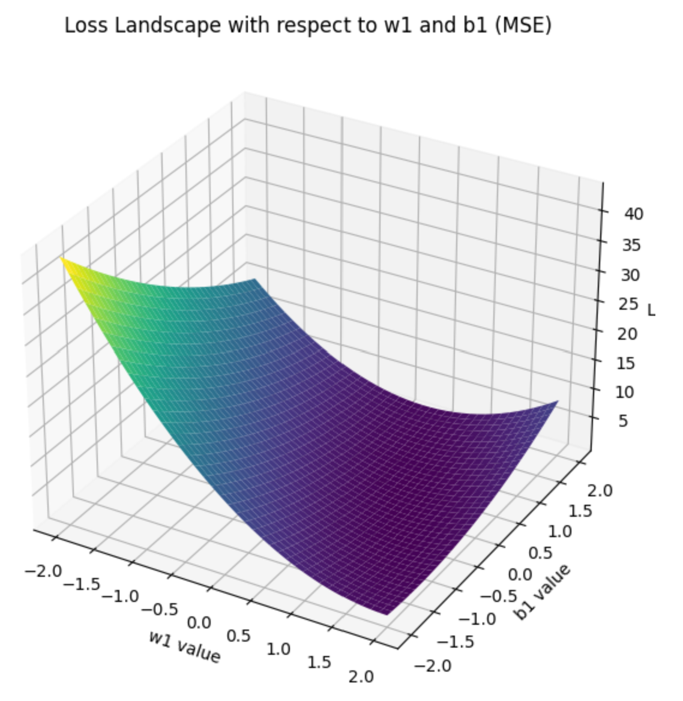
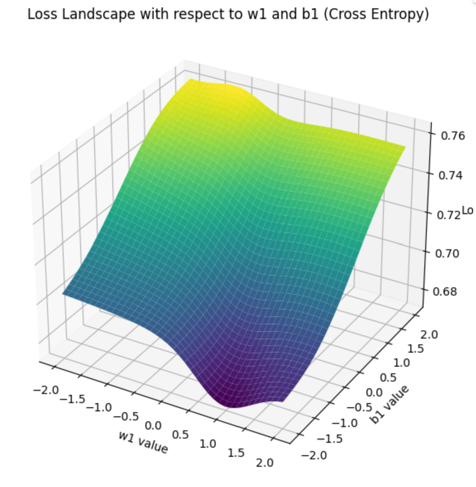

### A2.1 (5 points) 尝试解释Epoch、Iteration、Batch几个概念及其不同，尝试说明batch_size的选择依据和影响
#### 基础概念
在神经网络的训练过程中，有三个最基础的概念，分别是：Epoch（训练多少轮）, Batch（每次输入网络的样本的个数）和Iteration（迭代次数）。
这三个参数决定了神经网络的整个训练过程，并且对于神经网络的训练效果有很大的影响。

- `Epoch`：**一个epoch等于使用训练集中的全部样本训练一次的过程**。当一个完整的数据集通过了神经网络一次并且返回了一次，即进行了一次正向传播和反向传播，这个过程称为一个epoch。
- `Iteration`：简单来说，神经网络训练一个batch的过程称之为一个iteration。所谓iterations，就是完成一次epoch所需的batch个数。
- `Batch`：当一个epoch的样本（也就是训练集）数量太过庞大的时候，进行一次训练可能会消耗过多的时间，并且每次训练都使用训练集的全部数据是不必要的。
因此，我们就需要把整个训练集分成多个小块，也就是就是分成多个Batch来进行训练。

一个batch所包含的数据的个数称为batch_size，通常设为2的n次幂，常用的包括64,128,256。 网络较小时选用256，较大时选用64。

#### batch_size的选择依据和影响
1. 大batch_size可以更好地利用现代硬件的并行计算能力，尤其是GPU计算。因此，使用更大的batch_size通常可以提高训练速度；
2. batch_size和学习率通常是相关的。当使用较大的batch_size时，通常需要较大的学习率来保证模型的收敛速度和效果；
3. 较小的batch_size意味着每次更新都引入了更多的噪声，在权重更新中引入了更多的随机性，这种随机性可能有助于模型跳出局部最小值，但也可能导致权重更新的方向不够稳定。
另一方面，较大的batch_size可能会导致训练更快地收敛，但可能陷入局部最小值。
研究表明，适度的batch_size可以帮助模型更好地泛化。
4. 由于计算机的内存限制，batch_size不能设置过大，否则会导致内存不够用，产生溢出。

---

### A2.2 (5 points) 以一个简单的1-1-1结构的两层神经网络为例，分别采用均方误差损失函数和交叉熵损失函数，说明这两种函数关于参数的非凸性（可作图示意和说明）。

神经网络的1-1-1架构意味着，输入层有1个神经元，隐藏层有1个神经元，输出层有1个神经元。

我们使用tensorflow搭建一个简单的1-1-1结构的两层神经网络，其中隐藏层的激活函数为Sigmoid函数。

```python
import numpy as np
from tensorflow import keras
import matplotlib.pyplot as plt
from mpl_toolkits.mplot3d import Axes3D

# 定义一个简单的1-1-1结构的两层神经网络
model = keras.Sequential([
    keras.layers.Dense(1, activation=O, input_shape=(1,)),
    keras.layers.Dense(1)
])

# 我们使用均方误差损失函数进行示例代码展示
model.compile(loss='mean_squared_error')


# 定义一批简单的输入数据
x_train = np.array([0.5, 1.0, 1.5, 2.0])
y_train = np.array([0.0, 1.0, 1.0, 0.0])

# 为了展示的直观性，我们同时变化w1和b1的值，最终形成一个3D图像

# 生成w1和b1的网格
w1_values = np.linspace(-2, 2, 40)
b1_values = np.linspace(-2, 2, 40)
W1, B1 = np.meshgrid(w1_values, b1_values)

losses = np.zeros(W1.shape)

for i in range(W1.shape[0]):
    for j in range(W1.shape[1]):
        weights = model.get_weights()
        weights[0][0][0] = W1[i, j]
        weights[1][0] = B1[i, j]
        model.set_weights(weights)

        loss = model.evaluate(x_train, y_train, verbose=0)
        losses[i, j] = loss

# 画出关于w1和b1的损失函数图像证明其非凸性
fig = plt.figure(figsize=(10, 7))
ax = fig.add_subplot(111, projection='3d')
ax.plot_surface(W1, B1, losses, cmap='viridis')

ax.set_xlabel('w1 value')
ax.set_ylabel('b1 value')
ax.set_zlabel('Loss')
ax.set_title('Loss Landscape with respect to w1 and b1')

plt.show()
```
通过运行上述代码，我们可以得到如下的损失函数图像：

- 均方误差损失函数（Mean Squared Error, MSE）：



- 交叉熵损失函数（Cross Entropy, CE）：



由图像可以直观地看出，均方误差损失函数和交叉熵损失函数关于模型参数都是非凸的。

---

### A2.3 (5 points) 尝试推导：在回归问题中，假设输出中包含高斯噪音，则最小化均方误差等价于极大似然。

假设我们的回归模型是：
$$ y_{observed} = f(x; \theta) + \epsilon $$

- 其中，$ \epsilon $是噪音，$ \epsilon \sim \mathcal{N}(0, \sigma^2) $；

因此，在给定的模型参数 $ \theta $ 和输入 $ x $ 的情况下，观测到 $ y_{observed} $ 的概率为：
$$ p(y_{observed} | x; \theta) = \frac{1}{\sqrt{2\pi\sigma^2}} e^{-\frac{(y_{observed} - f(x;\theta))^2}{2\sigma^2}} $$

在极大化似然估计下，在整体数据集上基于模型参数 $ \theta $ 的似然函数为所有单个样本的似然函数的乘积，即：
$$ L(\theta) = \prod_{i=1}^{N} p(y_i | x_i; \theta) $$

对其取对数并化简展开，我们得到：
$$ \log L(\theta) = \sum_{i=1}^{N} \log(p(y_i | x_i; \theta)) $$
$$ = \sum_{i=1}^{N} \left[ -\frac{1}{2} \log(2\pi\sigma^2) - \frac{(y_i - f(x_i;\theta))^2}{2\sigma^2} \right] $$

由于 $ \log(2\pi\sigma^2) $ 是常数项，在最大化似然的过程中可以忽略，因此我们实际上需要最大化的是：
$$ \sum_{i=1}^{N} \left[ -\frac{(y_i - f(x_i;\theta))^2}{2\sigma^2} \right] $$

为了证明等价性简便，我们再移除分母上的常数项，并且去掉负号，将其转化为最小化问题，即：
$$ \sum_{i=1}^{N} (y_i - f(x_i;\theta))^2 $$

而在最小化均方误差的情况下，我们需要最小化的是：
$$ MSE(\theta) = \frac{1}{N} \sum_{i=1}^{N} (y_i - f(x_i;\theta))^2 $$

综上所述，我们可以得出结论：在回归问题中，假设输出中包含高斯噪音，则最小化均方误差等价于极大似然。

---

### A2.4 (5 points) 尝试推导：在分类问题中，最小化交叉熵损失等价于极大化似然。

在分类问题中，我们的模型输出是一个概率分布，即在给定的模型参数 $ \theta $ 和输入 $ x $ 的情况下，观测到 $ y $ 的概率。

为了证明的简便，我们假设一个二分类问题，即 $ y \in \{0, 1\} $。

对于一个给定的输入 $ x $，模型输出的概率分布为：
- $ p = P(y=1 | x; \theta) $；
- $ 1-p = P(y=0 | x; \theta) $；

给定一个样本，其真实的标签为 $ y $，则其似然函数为：
$$ L(\theta) = p^y (1-p)^{1-y} $$

在极大化似然估计下，在整体数据集上基于模型参数 $ \theta $ 的似然函数为所有单个样本的似然函数的乘积，即：
$$ L(\theta) = \prod_{i=1}^{N} p_i^{y_i} (1-p_i)^{1-y_i} $$

对其取对数并化简展开，我们可以得到：
$$ \log L(\theta) = \sum_{i=1}^{N} \log(p_i^{y_i} (1-p_i)^{1-y_i}) $$
$$ = \sum_{i=1}^{N} \left[ y_i \log(p_i) + (1-y_i) \log(1-p_i) \right] $$

由于 $ y_i $ 是常数项，在最大化似然的过程中可以忽略；进一步地，我们将其转化为最小化问题，得：
$$ \mathcal{L} = -\sum_{i=1}^{N} \left[ y_i \log(p_i) + (1-y_i) \log(1-p_i) \right] $$

并且，在这样的假设下，交叉熵损失函数可以表示为：
$$ \mathcal{L} = -[y \log(p) + (1-y) \log(1-p)] $$

综上，我们成功证明了：在分类问题中，最小化交叉熵损失等价于极大化似然。

---

### A2.5 (5 points) 分析为什么L1正则化倾向于得到稀疏解、为什么L2正则化倾向于得到平滑的解。

#### 概念梳理
- **L1正则化**：L1正则化是指在损失函数中加入L1范数(即 $\lambda \sum_{i} |w_i|$，模型参数的绝对值)作为正则项；
- **L2正则化**：L2正则化是指在损失函数中加入L2范数(即 $\lambda \sum_{i} w_i^2$，模型参数的平方和)作为正则项；
- **稀疏解与平滑解**：稀疏解指的是最终的模型参数很多都是0或者接近于0的，而平滑解指的是最终的模型参数都是比较小的值，没有很大的波动。

#### L1正则化倾向于得到稀疏解的原因
当模型参数的值变化时，L1正则化对损失函数的增加是常数的。这样的策略鼓励模型在某个方向上取零值，因为这样可以最大限度地减少总损失。

#### L2正则化倾向于得到平滑的解的原因
L2正则化的策略会使得大的参数值会受到较大的惩罚，因此其鼓励模型参数尽可能小（但是不为0），从而得到平滑的解。

---

### A2.6 (5 points) 分析Batch normalization对参数优化起到什么作用、如何起到这种作用

#### Batch Normalization的定义
Batch Normalization（Batch Norm）是一种在深度学习中用来提高训练速度和稳定性的技术，它的核心思想是对每一层的输入进行规范化，使其均值为0，方差为1。

#### Batch Normalization对参数优化的作用

- **缓解内部协变量偏移**：当网络的前面层的参数改变时，后面层的输入分布也会随之改变，这种现象称为“内部协变量偏移”（Internal Covariate Shift）。
Batch normalization通过规范化层的输入，这种现象得以大幅度减少，使得每一层都在一个更稳定的数据分布上工作。

- **允许使用更高的学习率**：在使用Batch Norm后，模型的训练将更加稳定，不容易出现偏移，因此我们可以使用更高的学习率，加速模型的收敛。

- **减少梯度消失或梯度爆炸**：由于规范化确保了输入值在一个合理的范围内，因此Batch Norm可以减少梯度消失或梯度爆炸问题。

#### Batch Normalization如何起到这种作用

Batch normalization的工作原理是，通过对每一层的输入进行规范化，使其具有零均值和单位方差，从而使每一层都在一个更稳定的数据分布上工作。

这种规范化通过以下公式实现：

$$ \hat{x} = \frac{x - \mu}{\sqrt{\sigma^2 + \epsilon}} $$

其中，$ \mu $ 是mini-batch的均值，$ \sigma^2 $ 是variance，$ \epsilon $ 是一个很小的数，目的是防止分母为零。

接着，为了恢复网络可能需要的任何表示能力，Batch Norm引入了缩放因子 $ \gamma $ 和偏移因子 $ \beta $，这两个因子都是可学习的参数。经过缩放和移位后的输出为：

$$ y = \gamma \hat{x} + \beta $$

这个过程确保了每一层的输入都是规范化的，从而使训练过程更加稳定和快速。
